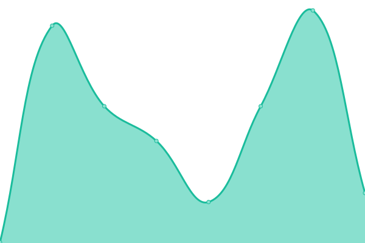
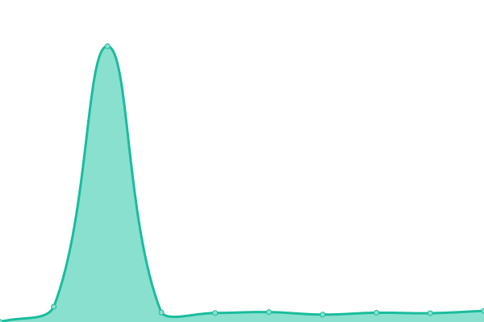

# [📈 Live Status](https://ConfluxBot.github.io/upt): <!--live status--> **🟧 Partial outage**

This repository contains the open-source uptime monitor and status page for [ConFI](https://ConfluxBot.github.io/upt), powered by [Upptime](https://github.com/upptime/upptime).

With [Upptime](https://upptime.js.org), you can get your own unlimited and free uptime monitor and status page, powered entirely by a GitHub repository. We use [Issues](https://github.com/ConfluxBot/upt/issues) as incident reports, [Actions](https://github.com/ConfluxBot/upt/actions) as uptime monitors, and [Pages](https://ConfluxBot.github.io/upt) for the status page.

<!--start: status pages-->
<!-- This summary is generated by Upptime (https://github.com/upptime/upptime) -->
<!-- Do not edit this manually, your changes will be overwritten -->
<!-- prettier-ignore -->
| URL | Status | History | Response Time | Uptime |
| --- | ------ | ------- | ------------- | ------ |
|  [Confluxscan](https://confluxscan.io) | 🟩 Up | [confluxscan.yml](https://github.com/ConfluxBot/upt/commits/HEAD/history/confluxscan.yml) | 

 511ms
     
 | 

<a href="https://ConfluxBot.github.io/upt/history/confluxscan">100.00%</a>
    

|  [Shuttleflow](https://shuttleflow.io) | 🟩 Up | [shuttleflow.yml](https://github.com/ConfluxBot/upt/commits/HEAD/history/shuttleflow.yml) | 

 905ms
     
 | 

<a href="https://ConfluxBot.github.io/upt/history/shuttleflow">100.00%</a>
    

|  [Conflux Netowrk](https://confluxnetwork.org) | 🟩 Up | [conflux-netowrk.yml](https://github.com/ConfluxBot/upt/commits/HEAD/history/conflux-netowrk.yml) | 

 383ms
     
 | 

<a href="https://ConfluxBot.github.io/upt/history/conflux-netowrk">100.00%</a>
    

|  [Conflux Bounty](https://bounty.conflux-chain.org) | 🟥 Down | [conflux-bounty.yml](https://github.com/ConfluxBot/upt/commits/HEAD/history/conflux-bounty.yml) | 

 0ms
     
 | 

<a href="https://ConfluxBot.github.io/upt/history/conflux-bounty">100.00%</a>
    

|  [Fluent Doc Site](https://conflux-chain.github.io/fluent-wallet-doc/) | 🟩 Up | [fluent-doc-site.yml](https://github.com/ConfluxBot/upt/commits/HEAD/history/fluent-doc-site.yml) | 

 157ms
     
 | 

<a href="https://ConfluxBot.github.io/upt/history/fluent-doc-site">100.00%</a>
    

|  [Fluent Basic Demo](https://dapp-demo.fluentwallet.dev/) | 🟥 Down | [fluent-basic-demo.yml](https://github.com/ConfluxBot/upt/commits/HEAD/history/fluent-basic-demo.yml) | 

 179ms
     
 | 

<a href="https://ConfluxBot.github.io/upt/history/fluent-basic-demo">100.00%</a>
    

|  [Conflux Hub](https://confluxhub.io) | 🟩 Up | [conflux-hub.yml](https://github.com/ConfluxBot/upt/commits/HEAD/history/conflux-hub.yml) | 

 519ms
     
 | 

<a href="https://ConfluxBot.github.io/upt/history/conflux-hub">100.00%</a>
    

|  [Conflux Governance](https://governance.confluxnetwork.org/) | 🟩 Up | [conflux-governance.yml](https://github.com/ConfluxBot/upt/commits/HEAD/history/conflux-governance.yml) | 

 803ms
     
 | 

<a href="https://ConfluxBot.github.io/upt/history/conflux-governance">100.00%</a>
    

<!--end: status pages-->

[**Visit our status website →**](https://ConfluxBot.github.io/upt)

## 📄 License

- Powered by: [Upptime](https://github.com/upptime/upptime)
- Code: [MIT](./LICENSE) © [ConFI](https://ConfluxBot.github.io/upt)
- Data in the `./history` directory: [Open Database License](https://opendatacommons.org/licenses/odbl/1-0/)
